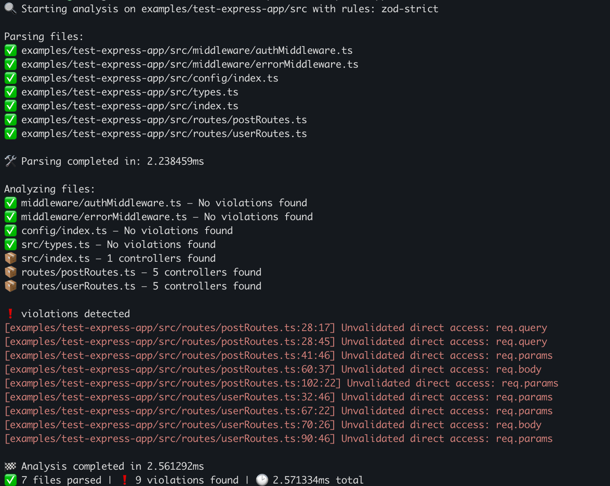

# ts-validator

[](https://www.npmjs.com/package/@stephen-collins-tech/ts-validator)
[](LICENSE)

**Rust-powered static analysis for TypeScript APIs.**  
Find unvalidated `req.body`, `req.query`, and `req.params` — before they cause runtime errors or security vulnerabilities.

---

## 🚀 Quickstart

No install needed. Just run:

```bash
npx @stephen-collins-tech/ts-validator path/to/entry-file.ts
```

Options:

```bash
npx @stephen-collins-tech/ts-validator --help
```

---

## ✨ What It Does

- Recursively parses `.ts` and `.tsx` files.
- Detects raw access to external inputs like `req.body`.
- Flags usage that may lack proper runtime validation.
- Supports flags: `--json`, `--fail-on-warning`, `--help`, `--version`.

---

## 🛡️ Why ts-validator?

TypeScript protects you at **compile time**.  
**ts-validator** protects you at **runtime** — when external data actually hits your app.

Don't trust unvalidated input. Catch it automatically.

---

## 🧰 For Contributors

Want to build locally or extend the tool?  
See [CONTRIBUTING.md](./CONTRIBUTING.md).

---

## Example Usage

```bash
npx @stephen-collins-tech/ts-validator src/index.ts
```

Output:



### JSON Output Mode

For CI/CD pipelines or programmatic usage, you can output the results as JSON:

```bash
npx @stephen-collins-tech/ts-validator src/index.ts --json
```

This outputs a single JSON string with the following structure:

```json
{
  "files_parsed": 10,
  "violations_count": 3,
  "elapsed_time_ms": 256,
  "violations": [
    {
      "file": "src/controllers/user.ts",
      "line": 12,
      "column": 23,
      "kind": "DirectAccess",
      "message": "Unvalidated direct access: req.body"
    }
  ]
}
```

#### Exit Codes

By default, ts-validator always returns an exit code of 0 even when violations are found. 

If you want to fail CI pipelines or scripts when violations are detected, use the `--fail-on-warning` flag:

```bash
npx @stephen-collins-tech/ts-validator src/index.ts --json --fail-on-warning
```

This will output the JSON data and exit with code 1 if any violations are found.

---

## 📦 Installation

### Global Installation

```bash
npm install -g @stephen-collins-tech/ts-validator
ts-validator --version
```

### Project Installation

```bash
npm install --save-dev @stephen-collins-tech/ts-validator
```

Then in your package.json:
```json
"scripts": {
  "validate": "ts-validator src/index.ts"
}
```

---

## 📈 Roadmap

- Smarter validation detection (`schema.parse(req.body)`)

---

## License

MIT License.